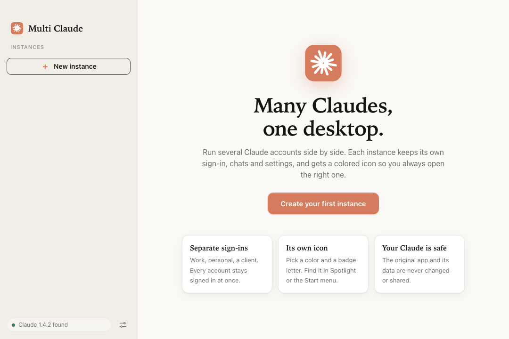
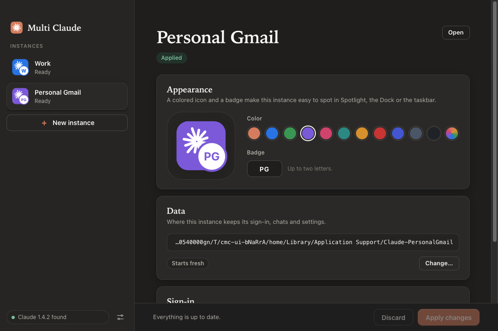

<div align="center">

# MuClaude

**Run several Claude Desktop accounts side by side.**<br>
Personal, work, client: each with its own sign-in, chats and settings, and its own colored icon so you always open the right one.

[](https://github.com/Aplex2723/muClaude/releases/latest)
[](https://github.com/Aplex2723/muClaude/actions/workflows/ci.yml)
[](LICENSE)

[](https://github.com/Aplex2723/muClaude/stargazers)


</div>

## Why MuClaude

Claude Desktop only lets you be signed in to one account. Switching means signing out and back in, and losing your place.
MuClaude gives every account its own isolated profile and its own launcher, so they run **at the same time**.

- **One click to open.** Double-click an instance to launch it. Single-click to choose **Open** or **Edit**.
- **Impossible to mix up.** Each instance gets a colored icon and a badge (initials or emoji) in the Dock, taskbar and app switcher.
- **Nothing shared.** Separate sign-ins, chats and settings per instance.
- **Safe by design.** On macOS your real `Claude.app` is never modified. Launchers are tiny apps in `~/Applications`.
- **Looks like it belongs.** Anthropic-style ivory and coral design, with light and dark mode.
- **Cleanly reversible.** Remove an instance and its launcher, and optionally its data, from the same window.

| Welcome | Dark mode |
| --- | --- |
|  |  |

## Install

### macOS (Apple Silicon)

1. Download **`MuClaude-x.y.z-arm64.dmg`** from the [latest release](https://github.com/Aplex2723/muClaude/releases/latest).
2. Open it and drag **MuClaude** to Applications.
3. First launch only: **right-click the app, choose Open**, then confirm. (The app is ad-hoc signed, not notarized, so macOS asks once.)

### Windows

Download the installer or the portable `.exe` from the [latest release](https://github.com/Aplex2723/muClaude/releases/latest).
Windows support is newer and less tested than macOS; please [report anything odd](https://github.com/Aplex2723/muClaude/issues/new/choose).

### From source

```bash
git clone https://github.com/Aplex2723/muClaude.git
cd muClaude/desktop
npm install
npm start               # run from source
npm run install:mac     # build MuClaude.app and copy it into /Applications
```

Requires [Claude Desktop](https://claude.ai/download) to be installed.

## How it works

| | macOS | Windows |
| --- | --- | --- |
| Launcher | small `Claude <Name>.app` in `~/Applications` | `.lnk` shortcuts (Desktop, Start menu) |
| Isolation | `open -na Claude.app --args --user-data-dir=<profile>` | patched copy of Claude with its own profile |
| Your original Claude | never touched | never touched |

Profiles live in `~/ClaudeInstances`. Deeper notes on the security model and edge cases are in [desktop/README.md](desktop/README.md).

## FAQ

**Is this allowed?** It is an independent community tool and is **not affiliated with, endorsed by, or supported by Anthropic**. It launches the official app with separate profiles; check your organization's policies before using it with a work account.

**Will my existing chats survive?** Yes. Existing profiles can be adopted, and chats stay in the profile folder. Nothing is uploaded anywhere, and MuClaude blocks all network access from its own window.

**Does it work with the old Python tool's instances?** Yes, MuClaude reads and writes the same `instances.json` manifest.

**Why does macOS say the app is from an unidentified developer?** It is not notarized yet. Right-click, then Open, once.

## Roadmap

- [ ] Notarized, universal (Intel + Apple Silicon) macOS build
- [ ] Linux support
- [ ] Auto-update
- [ ] Tested Windows installer
- [ ] Import/export instance lists

Ideas and votes are welcome in [Issues](https://github.com/Aplex2723/muClaude/issues).

## Contributing

PRs are welcome. See [CONTRIBUTING.md](CONTRIBUTING.md). If MuClaude saves you time, a star helps other people find it.

## Credits

MuClaude builds on the ideas and file layout of **[claude-multi-instance](https://github.com/Dipson-bot/claude-multi-instance)** by Dipson-bot, which created the original Python/Tkinter tool. Thank you for the groundwork. MuClaude keeps the same instance manifest and adds a much better UI: a modern Electron app with a real instance list, live icon preview, dark mode, safer handling of edge cases and a packaged macOS app. The original code is kept in `app/` and its README in `docs/ORIGINAL-README.md`.

## License

[MIT](LICENSE). "Claude" and "Anthropic" are trademarks of Anthropic, PBC.
