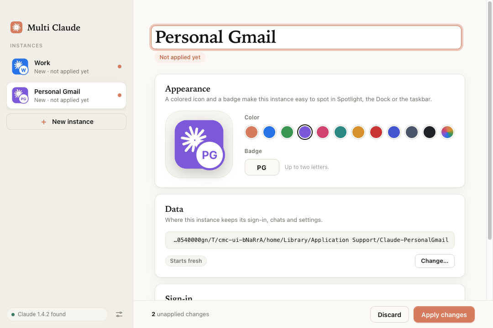

# MuClaude (desktop app)

Credits: based on [claude-multi-instance](https://github.com/Dipson-bot/claude-multi-instance) by Dipson-bot; MuClaude adds a much better UI.

A native-feeling Electron app for macOS and Windows that lets you run several
Claude Desktop accounts side by side. It replaces the old Tkinter wizard (still in
`../app`) with a modern interface and no Python requirement.



## Run / build

```bash
cd desktop
npm install
npm start               # run from source (development only)
npm test                # 21 core tests (temp HOME + fake Claude.app; touches nothing real)
npm run selfcheck       # launches the real window and confirms the UI rendered
npm run dist:mac        # -> dist/mac-arm64/MuClaude.app and dist/MuClaude-<ver>-arm64.dmg
npm run install:mac     # build + copy into /Applications (add -- --no-build to reuse the last build)
npm run dist:win        # run on Windows -> portable exe + installer
npm run icons           # regenerate build/icon.* from the in-app drawing routine
```

**Using it as a normal Mac app:** run `npm run install:mac`, or open the `.dmg` and drag
*MuClaude* to *Applications*. After that, launch it from Spotlight or Launchpad like any other
app; no terminal or npm needed. It is ad-hoc signed, not notarized, so the first time right-click it
and choose **Open**. This is an Apple Silicon build (an Intel build is untested).

## How it works

Same behavior and file layout as the Python version, so existing instances keep working.

- **macOS:** each instance is a tiny `~/Applications/Claude <Name>.app` that runs
  `open -na Claude --args --user-data-dir=<profile>`. Claude is never modified.
- **Windows:** one patched copy of Claude in `~/ClaudeInstances/app` (asar relocation fix,
  launch shim, integrity fuse off), self-tested on a throwaway profile before it is swapped in.
  Shortcuts are created with Electron's native API (no PowerShell string building).

## Security

- Renderer is sandboxed: `contextIsolation`, `sandbox`, no Node, strict CSP, all remote
  requests blocked, no navigation or popups, permissions denied.
- The preload exposes ten explicit functions; every IPC handler checks the sender and validates input.
- No network code. No telemetry.
- Deletion is confined to this tool's own locations, even if `instances.json` is tampered with
  (covered by tests). Profiles are only trashed if they are `Claude-<name>` folders under the data root.
- macOS launcher scripts single-quote every value; tested with `'` in names.
- Packaged build has Electron fuses set: no `RunAsNode`, no `NODE_OPTIONS`, no inspector flags, the app loads
  only from the ASAR, and **ASAR integrity validation is on** (a tampered copy is refused; tested).
  `GrantFileProtocolExtraPrivileges` stays on: turning it off stops `file://` pages loading from the ASAR
  (it would need a custom `app://` protocol).
- `npm audit`: 0 vulnerabilities (Electron 44, electron-builder 26). `allowScripts` in `package.json` approves
  only Electron's own download script and denies `electron-winstaller`.

## Edge cases handled

- Launcher apps are built in a temp folder and swapped in, so a failed rebuild keeps the old launcher.
- Instances succeed or fail independently; the manifest only lists what was really built.
- Unsafe profile folders (non-empty and not a Claude profile: `~`, `~/Documents`...) are refused, in the picker and in the core.
- A corrupt `instances.json` is backed up (`instances.json.corrupt-<time>`) instead of overwritten.
- If Claude is moved or renamed, launchers fall back to finding it by name; discovery also uses Spotlight.
- Bundle ids stay unique for names like `A-B` / `AB` / emoji (existing ids are unchanged).
- Quitting with unapplied changes asks first; quitting mid-apply is blocked.

## Status

- macOS: built, packaged and exercised end to end (`npm test`, UI driver `npm run screenshots`).
- Windows: ported from the audited Python code and unit-tested for the parts that are pure logic
  (asar read/write verified against `@electron/asar`, JS patching, fuse flip). **Not yet run on a real
  Windows PC**: the self-test, shortcuts, Startup folder and Run key need a real-machine check.
- Linux is not supported in this version.
